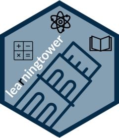

## Project's Overview

The Programme for International Student Assessment (PISA) is a well-known open data set that is freely available. This data has the ability to provide meaningful results and insights that can help with various decisions in the fields of education and research. This experiment has a direct influence on society for the benefit of people’s lives. In this project, we introduce the `learningtower` package, which provides a user-friendly easy accessibility to a subset of variables from PISA data gathered by the Organization for Economic Cooperation and Development (OECD) from 2000 to 2018. Following upon previous work, we integrate the 2022 dataset to allow users utilize to conduct various analytically and statistical analysis. In addition, we present a few example analysis utilizing this dataset addressing some research questions regarding the gender gap noticed in these students’, the effect of different socioeconomic factors on the students’ performance.

## learningtower 

The goal of `learningtower` is to provide a user-friendly R package to provide easy access to a subset of variables from PISA data collected from the [OECD](https://www.oecd.org/pisa/data/), for the years 2000 - 2022, collected on a three year basis. This is an excellent dataset for exploring and visualizing data. This dataset can also be used for other analytically purposes as well as statistical computations.

## What is PISA?

The Programme for International Student Assessment (PISA) is an international assessment measuring student performance in reading, mathematical and scientific literacy.

PISA assesses the extent to which 15-year-old students have acquired some of the knowledge and skills that are essential for full participation in society, and how well they are prepared for lifelong learning in the areas of reading, mathematical and scientific literacy.

In order to account for post COVID-19 problems, OECD member nations and associates decided to postpone the PISA 2021 evaluation to 2022 and the PISA 2024 assessment to 2025.

In 2022, PISA involved 81 countries and 700,000+ students worldwide.

Read more about the Programme [here](https://www.oecd.org/pisa/aboutpisa/).

## Special thanks

-   Dr Diane Cook, from Monash University, Australia.

-   Kevin Y.X. Wang, Senior Data Scientist, United States.

-   Priya Dingorkar, Data Scientist, Australia.
